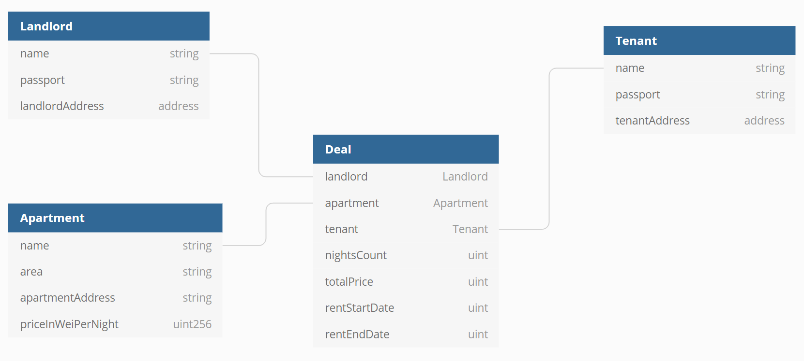

# RAOS

### RAOS (Rent Apartment On Solidity) project.
### Kotlin DSL for writing smart contracts on renting apartments.

## Content

- [Contract functionality](#Contract-functionality)
- [Contract struct schema](#Contract-struct-schema)
- [RAOS Kotlin DSL](#RAOS-Kotlin-DSL)

## Contract functionality

Description of methods, provided by the [RAOS smart contract](https://github.com/AndreyVolkovBI/RAOS/blob/master/RAOSContract.sol).

`setLandlord(string name, string passport)` - setter for landlord by name, passport, can only be called by the owner of contract

`setApartment(string name, uint area, string apartmentAddress)` - setter for apartment by name, area, address, can only be called by the owner of contract 

`setTenant(string name, string passport)` - setter for tenant by name, passport

`rentApartment` - renting apartment, can be called by tenant only 

Note: all the following methods can only be called by the members of the contract 

`getLandlord` - returns name and passport of landlord

`getTenant` - returns name and passport of tenant

`getApartment` - returns `Apartment` struct

`getDeal` - returns `nightsCount`, `totalPrice`, `rentStartDate`, `rentEndDate`

`getRentStartDate` - returns `rentStartDate` of deal

`getRentEndDate` - returns `rentEndDate` of deal

`getTimeLeft` - returns calculated time left for the renting apartment 

## Contract struct schema

`Landlord` & `Tenant` structures contain `name`, `passport` and `address`.

`Apartment` - apartment struct contains `name`, `area` (square meters), `apartmentAddress`, `priceInWeiperNight`.

`Deal` - struct that contains all other entities, and some additional info about 
number of nights (`nightsCount`), `totalPrice`, start and end date for rent itself. 



## RAOS Kotlin DSL
DSL that builds such contract looks as follows.

Basically, it was build to be as simple as possible and be readable for both computer and lawyer.

Here we describe all members of the contract in a pretty clear and nice structure.

```kotlin
contract(LANDLORD_PRIVATE_KEY, TENANT_PRIVATE_KEY) {

    landlord {
        name = "Ivan Ivanov"
        passport = "Ivan Ivanov's passport data"
    }

    tenant {
        name = "Ilya Sidorov"
        passport = "Ilya Sidorov's passport data"
    }

    apartment {
        name = "Apartment on Petrovka street, near to The Big Theatre"
        address = "Russia, Moscow, Petrovka st. 7, 25"
        area = 57
        priceInWeiPerNight = 10000
    }

    deal {
        priceInWei = 9 * 10000
    }
}
```
